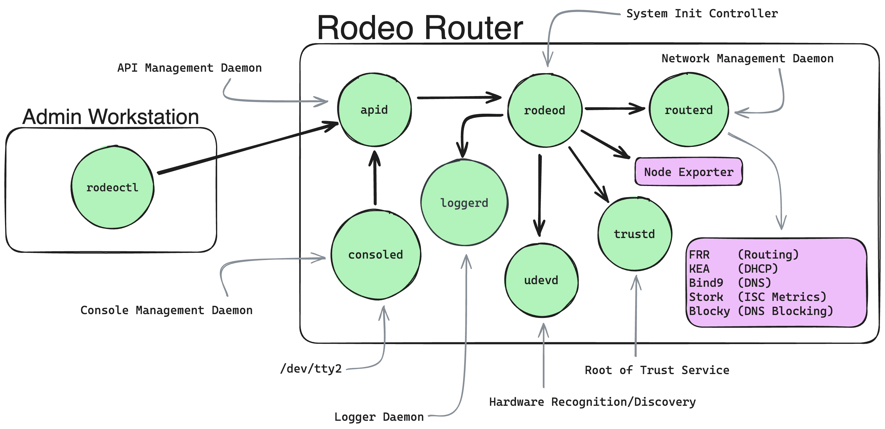

# Architectural Overview

This document provides an overview of the architecture of the project. It is intended to provide a high-level understanding of the system and its components.

## First-Party Components

The Rodeo Router project is composed of several key components:

- `rodeoctl`: The primary CLI tool for managing the Rodeo Router
- `rodeod`: The system init daemon that runs on the router
- `apid`: The API daemon that provides GRPC and RESTful API for managing the router
- `routerd`: The core routing daemon that manages many third-party services such as FRR, Kea, and Bind
- `trustd`: The trust daemon that manages the trust relationships between the router, subcomponents, and high-availability peers
- `loggerd`: The logging daemon that manages the logs generated by the router
- `udevd`: The device management daemon that manages devices connected to the router
- `consoled`: The console daemon that provides a console interface for managing the router

### Potential First-Party Components (TBD)

> [!IMPORTANT]
> These components have not been fully defined and may not be included in the final architecture.

- `configd`: The configuration daemon that manages the configuration of the router

## Third-Party Components

The Rodeo Router project relies on several third-party tools and services to provide core functionality:

- [FRRouting](https://frrouting.org/): Routing daemon that provides dynamic routing capabilities
- [ISC Kea](https://www.isc.org/kea/): DHCP server that provides DHCP services
- [ISC Bind](https://www.isc.org/bind/): DNS server that provides DNS services
- [Stork](https://www.isc.org/stork/): Monitoring and management system for Kea and Bind
- [Prometheus Node Exporter](https://github.com/prometheus/node_exporter): Prometheus exporter for system metrics
- [Blocky](https://github.com/0xERR0R/blocky): DNS proxy and ad-blocker
